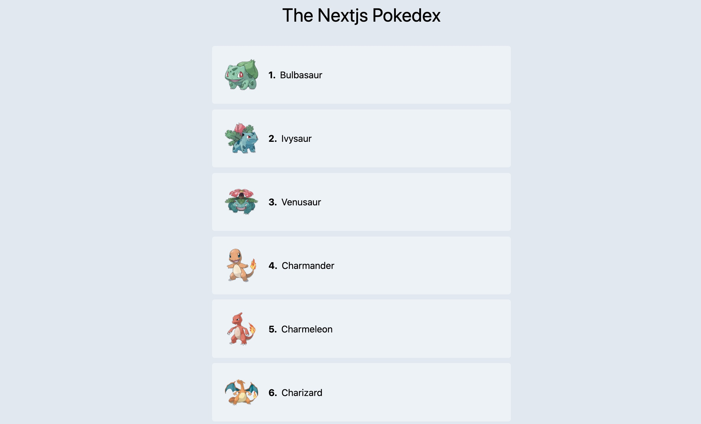

# Pokemon Gallery

A Gallery of pokemon with individual static pages for each pokeman as pages.


## API Reference

#### Get all pokemon

```http
  GET https://pokeapi.co/api/v2/pokemon?offset=0&limit=30
```

| Parameter | Type     |
| :-------- | :------- |
| `none` | `array`     |

#### Get pokemon

```http
  GET https://pokeapi.co/api/v2/pokemon/1
```

| Parameter | Type     | Description                       |
| :-------- | :------- | :-------------------------------- |
| `id`      | `string` | **Required**. Id of item to fetch |


#### Get pokemon image
```http
  GET  https://assets.pokemon.com/assets/cms2/img/pokedex/detail/001.png
  ```

| Parameter | Type     | Description                       |
| :-------- | :------- | :-------------------------------- |
| `id`      | `string` | **Required**. Id of item to fetch |
## Authors

- [@jainChetan](https://thechetanjain.in)

## Color Reference

| Color             | Hex                                                                |
| ----------------- | ------------------------------------------------------------------ |
| Background Color|  #131313 |
| Text Color |  #ffffff|


## Install

To install this project with npm or yarn.
Go to project directory


```bash
  git clone https://github.com/jainChetan81/Pokemon-Gallery.git
  cd Pokemon-Gallery
```

then

```bash
  npm install || yarn install
  npm run dev || yarn dev
```


## Build

To build this project with npm or yarn.
Go to project directory

```bash
  npm run build || yarn build
```
To build this project with static pages without edge functions where Server Side Rendering won't work
```bash
  npm run build && npm run export || yarn dev && yarn export
```


## Tech Stack

**Client:** React, ContextAPI, SASS Modules

**ContextAPI**- for State managment\
**next-pwa** - for time manipulation\
**sass modules** - so sass classes won't mixup and names can be reused\
**react-icons** - for various icons\
**tailwindcss** - for css utilities and JIT compiler

## Project Structure
    --- ## components
    --- ## pages
    --- ## styles
    --- ## .eslint.json
    --- ## jest.config.js
    --- ## tsconfig.json

## Lessons Learned

- I started this project to learn about nextjs and generatic static and server side pages with it.
- NextJS is a framework based on react that enables us to create server side rendering application or static pages or hybrid app like this one
- There are mainly two type of Applications develped by Next :- \
    **Static Generation (Recommended)**: The HTML is generated at build time and will be reused on each request. \
    **Server-side Rendering**: The HTML is generated on each request.

- Since Next is based on React, the whole concept of React is applied here from components to states or props, except for routing which is provided by Next
- The main difference in Next vs CRA is 3 different functions which can be declared in components
- **getStaticProps** - If you have external data fetch that data in ths function. This function gets called at build time and lets you pass fetched data to the page's props on pre-render.
- **getServerSideProps** - The HTML is generated on each request. Because Server-side Rendering results in slower performance than Static Generation, use this only if absolutely necessary.
- **getStaticPaths** - uses dynamic routes, Next.js will statically pre-render all the paths specified
- **useEffect** - lifecycle that runs every time there is a change


## Contributing

Contributions are always welcome!

See project structure

Please adhere to the Project Structure


## Feedback

If you have any feedback, please reach out to me at jain.cj.chetan@gmail.com


## 🚀 About Me
I am a Full Stack Web Developer with over two years of experience in various tech stacks.


## 🔗 Links
[](https://thechetanjain.in/)
[](https://thechetanjain.in/linkedin/)
[](https://thechetanjain.in/github)


## Screenshots


## Running Tests

To run tests with unit testing and end to end testing and finally a report, run the following command

```bash
  npm run test
  npm run test:cypress
  test:mocha-report
```

## Demo


